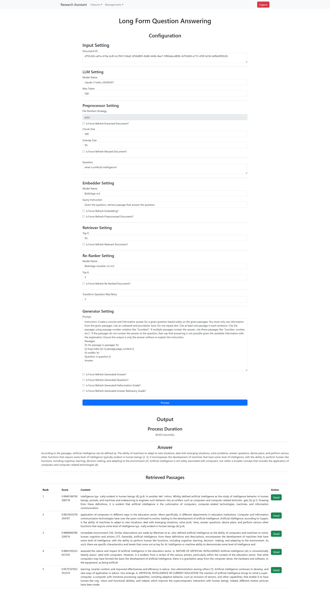
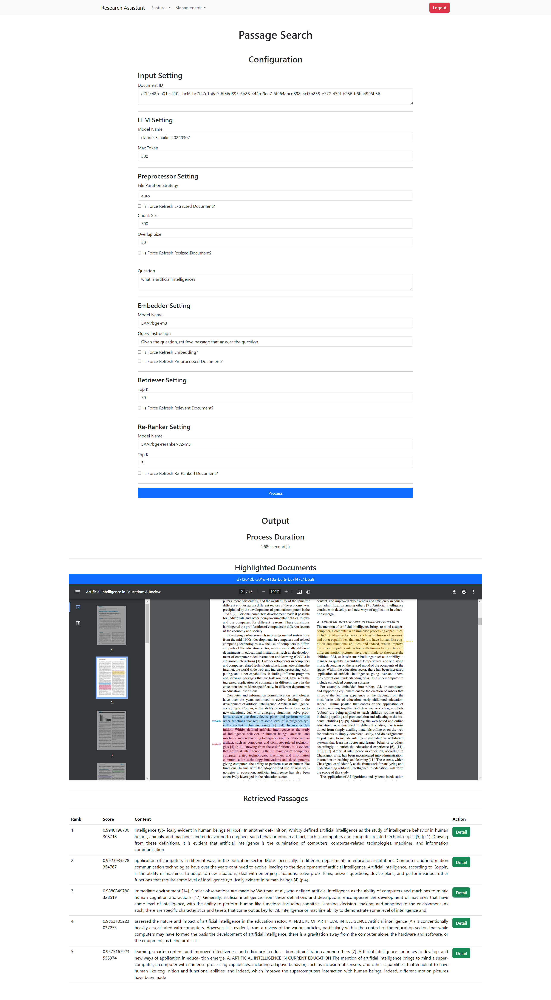
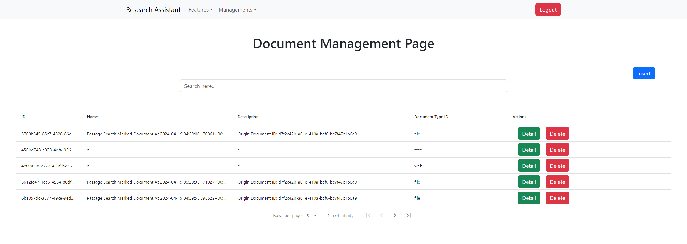

# research-assistant-frontend

## Features

- Long Form QA

- Passage Search

- Document Management


## Getting Started
1. Clone [infrastructure](https://github.com/muazhari/research-assistant-infrastructure), [backend](https://github.com/muazhari/research-assistant-backend), and [frontend](https://github.com/muazhari/research-assistant-frontend) repositories.
2. Setup infrastructure, backend, and frontend dependencies.
3. Run the infrastructure, backend, and frontend services. 

## Setup

Install the dependencies:

```bash
bun install
```

## Run

Start the dev server:

```bash
bun run start
```

Build the app for production:

```bash
bun run build
```

Preview the Production build product:

```bash
bun run preview
```

Clear persistent cache local files

```bash
bun run clean
```
