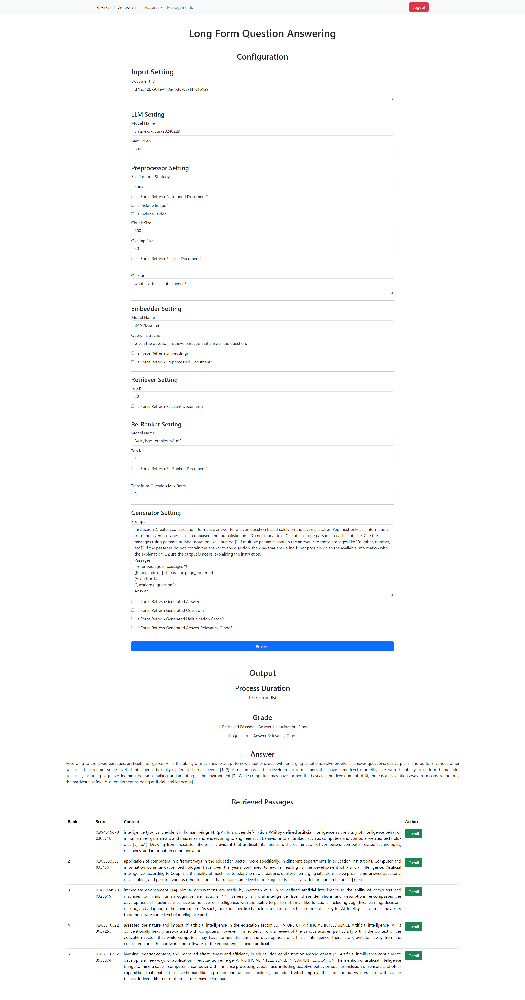
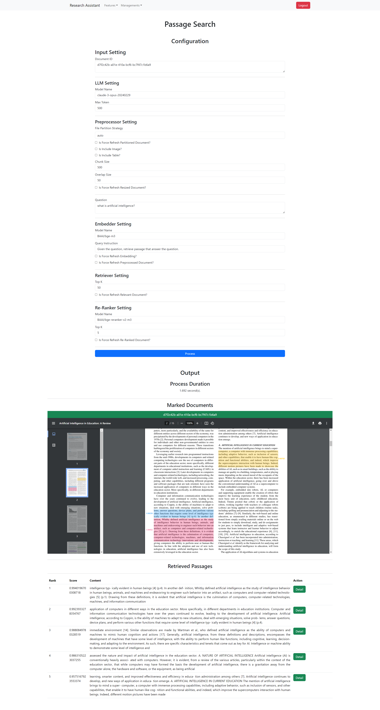

# research-assistant-frontend

## Features

- Long Form QA

- Passage Search

- Document Management


## Setup

Install the dependencies:

```bash
bun install
```

## Get Started

Start the dev server:

```bash
bun run start
```

Build the app for production:

```bash
bun run build
```

Preview the Production build product:

```bash
bun run preview
```

Clear persistent cache local files

```bash
bun run clean
```
